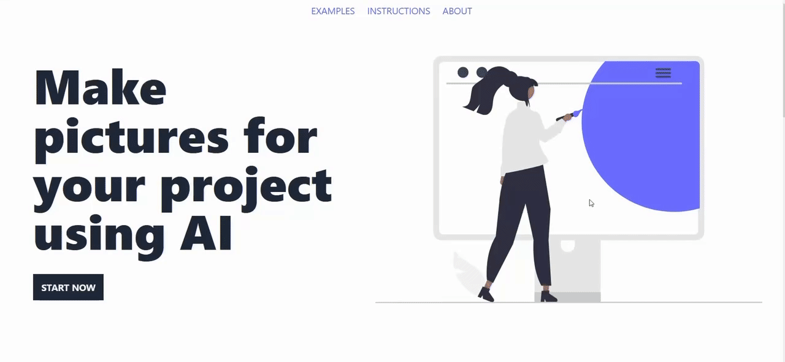

# Image generator
Make images in the same style for your project using AI. 

**Disclamer!** The project has run out of tokens to support AI. A solution to this problem is being developed.  



### Website
[Image generator](https://open-image-generator.vercel.app/en)

### Features
⭐️ Responsive design  
⭐️ Mobile version  
⭐️ Dark theme

##### [Dark theme + mobile (demo video)](mobile-image-generator.gif)

### Installation
```
git clone git@github.com:po1inakoroleva/image-generator.git
```
```
npm ci
```
Run the development server
```
npm run dev
```
### Built with  
 
 
 
 
 
 
  
